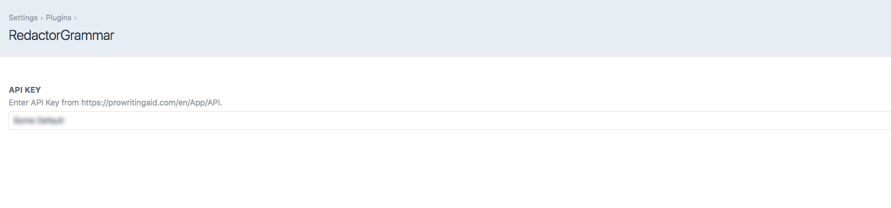

# RedactorGrammar plugin for Craft CMS 3.x

Redactor and Beyond Grammar Checking extension

## Requirements

This plugin requires Craft CMS 3.0.0-beta.23 or later.

## Installation

To install the plugin, follow these instructions.

1. Open your terminal and go to your Craft project:

        cd /path/to/project

2. Then tell Composer to load the plugin:

        composer require fatfish/redactorgrammar

3. In the Control Panel, go to Settings → Plugins and click the “Install” button for RedactorGrammar.

## RedactorGrammar Overview

   RedactorGrammar is an extension which allows real-time grammar checking, spelling, style checking and terminology management right into your Craft website.

## Configuring RedactorGrammar

** In order to use this plugin you must have the Redactor plugin installed and configured properly. **

In order to use this plugin you first need to obtain the Beyond Grammar Checking API from http://prowritingaid.com/en/App/BeyondGrammar and then enter your API key in the plugin's settings page.

Voila! you are done.

## Credits

* Pixel & Tonic (Redactor plugin powered by https://imperavi.com/redactor/)
* ProWritingAid (https://prowritingaid.com/)

Brought to you by [fatfish](https://fatfish.com.au)
